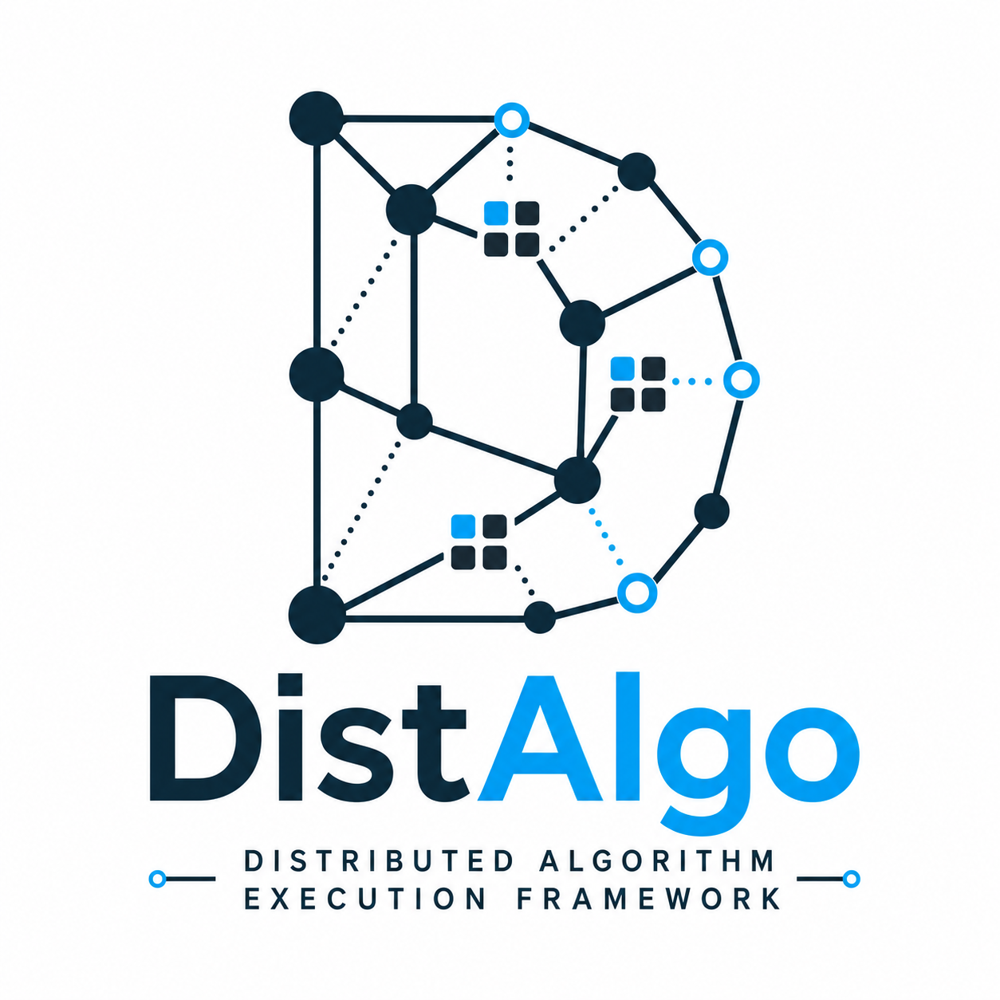
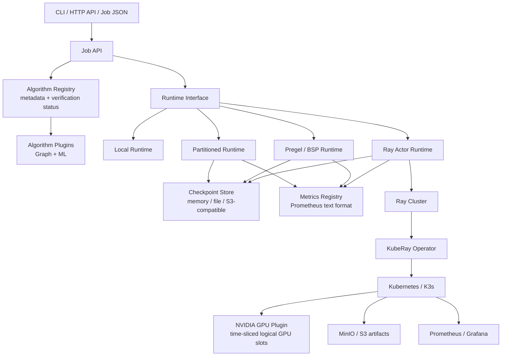

# DistAlgo



> Distributed algorithm execution framework for graph mining and machine
> learning, with cloud-native deployment as a first-class runtime option.

DistAlgo is a distributed algorithm execution framework. Its core concern is
algorithm semantics: partitioning, iteration, message passing, aggregation,
checkpointing, convergence, and plugin contracts. Kubernetes, K3s, Ray, KubeRay,
MinIO, and Prometheus are deployment/runtime substrates, not the identity of the
project.

GitHub repository name: `DistAlgo`.

## 中文简介

DistAlgo 是一个运行在分布式执行模型之上的图算法和机器学习算法框架。它支持用同一套作业接口描述 PageRank、SSSP、Louvain、KMeans 等算法，并通过本地分区运行时、Pregel/BSP 运行时、Ray Actor 适配层、KubeRay 集群和 GPU 资源声明逐步落地。

项目目标不是重新实现 Kubernetes 调度器，也不是做单机 HPC demo。Kubernetes/K3s 负责资源生命周期、隔离、队列、服务发现和可观测性；DistAlgo 负责算法如何被切分、如何通信、如何迭代、如何 checkpoint、如何恢复、如何暴露统一插件接口。

DistAlgo 面向多种分布式计算架构，而不是只绑定一种 master-worker 形态：

- Master-Worker / Coordinator-Worker：适合 KMeans、Linear Regression、统计聚合、特征选择等“worker 计算局部结果，coordinator 合并全局状态”的算法。
- BSP / Pregel：适合 PageRank、SSSP、BFS、Connected Components、Label Propagation、Louvain 等图迭代和消息传递算法。
- MapReduce / Shuffle：适合边表重分区、join、groupBy、图构建、特征生成等数据重排型任务。
- Actor / Peer-to-Peer：适合长期持有分区状态的 worker，通过 actor RPC 交换边界消息。
- Parameter Server：适合稀疏模型、embedding、在线更新类参数状态。
- AllReduce / Collective：适合梯度、中心点、稠密向量的同步聚合，也是未来多 GPU/NCCL 的边界。
- Pipeline DAG：适合图构建、特征抽取、算法执行、结果落库组成的多阶段工作流。

## Architecture



## Design Principles

- Algorithm first: graph and ML algorithm semantics are separated from the
  cluster substrate.
- Explicit compute models: every algorithm declares whether it is message
  passing, aggregation, shuffle, allreduce, parameter-server, pipeline, or
  actor-peer oriented.
- Deterministic local path: every distributed feature has a deterministic local
  validation path before requiring a cluster.
- Runtime adapters, not algorithm forks: algorithms should not need separate
  implementations for local, Ray, or KubeRay execution.
- Checkpoint before retry: recovery is based on iteration/global/partition state
  rather than opaque pod restarts.
- Verification is visible: each algorithm has an explicit status showing whether
  it has passed distributed-framework tests.

## Compute Models

| Model | Typical Algorithms | Runtime Pattern |
| --- | --- | --- |
| `graph_message` | PageRank, SSSP, BFS, Connected Components, Label Propagation, Louvain | BSP/Pregel supersteps, partition messages, convergence checks |
| `aggregation` | KMeans, Linear Regression, histograms | Worker-local compute, coordinator aggregation, broadcast updated global state |
| `map_reduce_shuffle` | joins, groupBy, feature generation | repartition, shuffle, reduce, materialize |
| `parameter_server` | sparse models, embeddings | workers push/pull parameter shards |
| `allreduce` | distributed gradients, centroid updates | collective communication, NCCL/UCX boundary for real multi-GPU |
| `pipeline` | graph feature pipelines, ML workflows | staged execution with checkpointed artifacts |
| `actor_peer` | long-lived graph workers | Ray actors, peer-to-peer partition messages |

## Distributed Architecture Support

| Architecture | Status | Notes |
| --- | --- | --- |
| Master-Worker / Coordinator-Worker | implemented | Aggregation-style algorithms run through partitioned local runtime; KMeans and Linear Regression are verified. |
| BSP / Pregel | implemented | SSSP is verified through `PregelRuntime`; graph-message algorithms have partitioned-runtime coverage. |
| Actor / Peer-to-Peer | implemented seam | `RayActorRuntime` creates partition workers as actors and is tested with a Ray-compatible fake runtime; remote KubeRay cluster execution is validated. |
| MapReduce / Shuffle | planned seam | Partitioning and data-loader foundations exist; full shuffle runtime is future work. |
| Parameter Server | planned seam | Execution model is represented; runtime implementation is future work. |
| AllReduce / Collective | planned seam | Single-GPU scheduling is validated; true NCCL/UCX requires multi-GPU hardware. |
| Pipeline DAG | planned seam | Intended for multi-stage graph/ML workflows. |

## Algorithm Verification Status

`distributed_verified` means the algorithm has been tested through a framework
runtime with multiple partitions, Pregel-style execution, or Ray actor adapter
coverage. It does not mean production-scale performance has been certified.

| Algorithm | Category | Status | Verification Level |
| --- | --- | --- | --- |
| `bfs` | Graph | `distributed_verified` | partitioned local + Ray actor adapter |
| `connected_components` | Graph | `distributed_verified` | partitioned local |
| `k_core` | Graph | `distributed_verified` | partitioned local |
| `k_hop` | Graph | `distributed_verified` | partitioned local |
| `label_propagation` | Graph | `distributed_verified` | partitioned local |
| `louvain` | Graph community detection | `distributed_verified` | partitioned local |
| `pagerank` | Graph ranking | `distributed_verified` | partitioned local |
| `sssp` | Graph shortest path | `distributed_verified` | Pregel runtime |
| `triangle_count` | Graph mining | `distributed_verified` | partitioned local |
| `kmeans` | Machine learning | `distributed_verified` | partitioned local |
| `linear_regression` | Machine learning | `distributed_verified` | partitioned local |

Programmatic status:

```bash
PYTHONPATH=src python3 -m distalgo.cli list-algorithms --status
PYTHONPATH=src python3 -m distalgo.cli list-algorithms --json
```

## Quick Start

```bash
python3 -m pip install -e .
make test
make smoke
```

GPU visibility smoke check:

```bash
make gpu-probe
```

Run an example job:

```bash
PYTHONPATH=src python3 -m distalgo.cli run examples/pagerank_job.json \
  --output /tmp/distalgo-pagerank-result.json
```

Serve the API:

```bash
PYTHONPATH=src python3 -m distalgo.cli serve --host 127.0.0.1 --port 8000
```

Routes:

- `GET /healthz`
- `GET /algorithms`
- `POST /jobs`
- `GET /metrics`

## Deployment

Manifests and deployment helpers:

- `deploy/docker-compose.yaml`
- `deploy/kuberay/raycluster.yaml`
- `deploy/kuberay/raycluster-gpu.yaml`
- `deploy/kubernetes/distalgo-service.yaml`
- `deploy/observability/prometheus-config.yaml`
- `scripts/install_remote_kuberay.sh`
- `scripts/fix_remote_k3s_kuberay.sh`
- `scripts/import_remote_image_to_k3s.sh`
- `scripts/remote_cluster_status.sh`
- `scripts/remote_gpu_ray_smoke.sh`

Remote validation has been performed on a single RTX 5090 32GB host with K3s,
NVIDIA device plugin time-slicing, KubeRay, and a RayCluster. See
[validation report](docs/validation-report.md).

## GPU Boundary

A single RTX 5090 validates CUDA visibility, Kubernetes GPU resource
advertisement, Ray/KubeRay scheduling, and logical multi-worker GPU allocation.
The project has a Ray actor resource seam for `num_gpus` / fractional GPU
scheduling, plus a remote K3s smoke script:

```bash
make remote-gpu-smoke
```

This does not validate GPU algorithm kernels or true physical multi-GPU
NCCL/UCX behavior. Real multi-GPU validation requires at least two visible CUDA
devices.

See [GPU validation](docs/gpu-validation.md).

---

## English Overview

DistAlgo is a distributed execution framework for graph and machine learning
algorithms. It provides a shared job interface, algorithm registry, runtime
abstractions, checkpointing, metrics, and deployment manifests for cloud-native
execution.

Cloud-native infrastructure is a deployment form. The project itself is centered
on distributed algorithm execution.

Supported distributed architecture families include coordinator-worker,
BSP/Pregel message passing, actor peer-to-peer execution, MapReduce/shuffle,
parameter-server, allreduce/collective, and pipeline DAG execution. The first
three have working runtime coverage or adapter seams in this repository; the
others are explicit roadmap boundaries.

## Repository Layout

```text
src/distalgo/          Python package
tests/                 Unit and framework-runtime tests
examples/              Example job specs
deploy/                Docker Compose, Kubernetes, KubeRay, Prometheus manifests
scripts/               Remote K3s/KubeRay/GPU helper scripts
docs/                  Architecture, algorithm, GPU, and validation notes
```

## License

MIT
