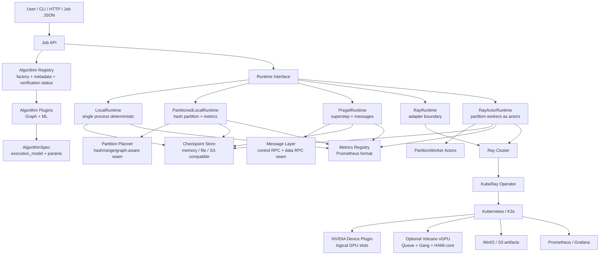

# DistAlgo Architecture

DistAlgo is a distributed algorithm execution framework. Cloud-native deployment
is one supported landing form, not the core identity. The framework owns
algorithm semantics; Kubernetes, K3s, Ray, KubeRay, MinIO, and Prometheus own
runtime infrastructure concerns.

## Goals

- Provide one job contract for graph mining and machine learning algorithms.
- Make distributed execution models explicit instead of hiding everything behind
  a generic `compute()` method.
- Keep algorithms testable in deterministic local runtimes before using a real
  cluster.
- Support cloud-native deployment without coupling algorithm code to
  Kubernetes APIs.
- Track algorithm verification status so users can distinguish implemented,
  locally tested, and distributed-framework-tested algorithms.

## Non-Goals

- DistAlgo does not replace Kubernetes, Kueue, Volcano, or Ray schedulers.
- DistAlgo does not claim true multi-GPU NCCL validation on a single GPU host.
- DistAlgo does not certify production-scale performance from unit tests alone.

## High-Level Architecture



## Supported Distributed Architecture Families

DistAlgo is designed for several distributed architecture families. They are
separate because they have different communication, state, scheduling, and
failure-recovery requirements.

### Master-Worker / Coordinator-Worker

The coordinator creates the job, partitions input, assigns work, receives
partial results, updates global state, and decides whether to continue. Workers
own local data shards and perform local compute.

Best fit:

- KMeans
- Linear Regression
- Boruta-style feature selection
- histograms and statistics
- model evaluation over data shards

Current status: implemented through `PartitionedLocalRuntime` and verified for
KMeans and Linear Regression.

### BSP / Pregel

The job runs as supersteps. Each worker owns a graph partition, computes local
state, emits messages to neighbor partitions, and synchronizes at barriers until
convergence.

Best fit:

- PageRank
- SSSP
- BFS
- Connected Components
- Label Propagation
- Louvain-style community detection

Current status: `PregelRuntime` exists and SSSP is verified through it. Other
graph algorithms have partitioned-runtime verification and are structured for
message-passing runtime evolution.

### Actor / Peer-to-Peer

Workers are long-lived actors. Each actor owns partition state and exposes RPC
methods for boundary messages, state snapshots, and result collection. This
reduces coordinator data traffic for graph workloads.

Best fit:

- stateful graph workers
- iterative community detection
- k-hop neighborhood expansion
- algorithms that benefit from partition-local caches

Current status: `RayActorRuntime` is implemented with a Ray-compatible adapter
test. A remote K3s/KubeRay RayCluster has been validated for real Ray execution.

### MapReduce / Shuffle

Workers map input rows or edges to keys, repartition by key, and reduce grouped
values. Shuffle is expensive and should be explicit rather than hidden inside an
algorithm plugin.

Best fit:

- graph construction
- edge-list repartition
- joins and groupBy operations
- graph feature generation

Current status: planned runtime seam. Data loading and partition primitives are
present.

### Parameter Server

Workers push sparse updates and pull parameter shards from parameter servers.
This is useful when global model state is too large or sparse for simple
broadcast aggregation.

Best fit:

- sparse linear models
- embeddings
- online learning

Current status: planned runtime seam.

### AllReduce / Collective

Workers perform collective communication over dense tensors or vectors. This is
the natural shape for distributed gradients and some centroid/vector updates.

Best fit:

- distributed gradients
- dense vector aggregation
- multi-GPU training primitives

Current status: planned runtime seam. Single-GPU scheduling is validated; true
NCCL/UCX requires multiple physical GPUs.

### Pipeline DAG

The job is a graph of stages: load data, construct graph, extract features, run
algorithm, persist results, publish metrics. Each stage can use a different
execution model.

Best fit:

- graph ML feature workflows
- recurring production pipelines
- multi-algorithm experiments

Current status: planned workflow seam.

## Responsibility Boundary

Kubernetes/K3s manages:

- Pods, services, namespaces, lifecycle, and node placement.
- CPU, memory, GPU, and storage resource boundaries.
- Image policy, service discovery, logs, secrets, and network policy.
- Optional queueing and gang scheduling through Kueue or Volcano.
- Optional vGPU memory/core limits through the Volcano vGPU + HAMi-core profile.

Ray/KubeRay manages:

- Task and actor placement.
- Ray object references and worker lifecycle.
- Resource-aware scheduling, including CPU/GPU resource declarations.
- Ray dashboard and cluster membership.

Volcano/HAMi manages, when enabled:

- `schedulerName: volcano` placement for Pods and VolcanoJobs.
- PodGroup/Gang Scheduling through `minAvailable`.
- Queue-level resource `capability`.
- vGPU resource names such as `volcano.sh/vgpu-memory`.
- In-container GPU memory/core limits through HAMi-core.

DistAlgo manages:

- Algorithm registry and plugin contracts.
- Execution model declarations.
- Data partitioning and partition metadata.
- Iteration, convergence, and checkpoint cadence.
- Cross-partition messages, shuffles, partial aggregates, and global state.
- Algorithm-level metrics, reports, and verification metadata.

## Design Philosophy

### 1. Algorithms Are Portable

An algorithm implementation should not import Kubernetes or Ray directly. It
declares an `AlgorithmSpec`, receives data plus partition count, and returns an
`AlgorithmResult`. Runtime adapters decide how to place work.

### 2. Execution Models Are First-Class

Distributed algorithms fail when different communication patterns are forced
into one abstraction. DistAlgo names the model explicitly:

- message passing
- aggregation
- shuffle
- parameter server
- allreduce
- pipeline
- actor peer-to-peer

### 3. Local Determinism Comes Before Cluster Scale

Every algorithm should pass deterministic local tests. Distributed runtimes then
validate partitioning, messaging, actor behavior, checkpointing, and resource
metadata without changing algorithm names.

### 4. Checkpoint Is a Product Contract

Checkpoint data is not a side effect. It is part of the execution contract:

- current iteration
- algorithm config
- global state
- partition state paths
- input data version
- code version

### 5. Verification Must Be Visible

The registry exposes whether each algorithm has passed distributed-framework
tests. This avoids over-claiming support and helps contributors know what still
needs validation.

## Compute Models

| Model | Data Shape | Communication | Examples | DistAlgo Runtime Path |
| --- | --- | --- | --- | --- |
| `graph_message` | graph partitions | boundary messages per superstep | PageRank, SSSP, BFS, Connected Components, Label Propagation, Louvain | `PregelRuntime`, `PartitionedLocalRuntime`, `RayActorRuntime` seam |
| `aggregation` | table/vector shards | partial aggregates to coordinator | KMeans, Linear Regression, histograms | `PartitionedLocalRuntime` |
| `map_reduce_shuffle` | key/value or edge shards | repartition + shuffle | graph construction, joins, feature generation | planned runtime seam |
| `parameter_server` | sparse vectors or embeddings | push/pull parameter shards | embeddings, sparse online models | planned runtime seam |
| `allreduce` | dense tensors/vectors | collective communication | gradients, centroid updates | planned GPU/multi-node seam |
| `pipeline` | staged artifacts | stage input/output dependencies | graph ML pipelines | planned workflow seam |
| `actor_peer` | long-lived partition ownership | peer actor calls | partition workers, graph message services | `RayActorRuntime` |

## Algorithm Plugin Contract

Each plugin implements:

```python
class Algorithm:
    spec: AlgorithmSpec

    def run(self, data, partitions: int) -> AlgorithmResult:
        ...
```

The spec identifies the algorithm name, family, and execution model. The result
contains output, metrics, iteration count, and completion state.

## Repository Layout

```text
src/distalgo/
  algorithms/
    graph/
    ml/
  backends/
  core/
  cli.py
tests/
examples/
deploy/
scripts/
docs/
```

## Current Runtime Coverage

- `LocalRuntime`: deterministic single-process execution.
- `PartitionedLocalRuntime`: partition-aware local execution with partition
  metrics.
- `PregelRuntime`: superstep-oriented graph execution path.
- `RayRuntime`: Ray adapter boundary.
- `RayActorRuntime`: actor-backed partition-worker path using Ray-like APIs.
- KubeRay deployment: validated on a remote K3s single-node cluster.

## Production Roadmap

Near-term:

- Add remote end-to-end tests that submit DistAlgo jobs into the KubeRay
  RayCluster.
- Add MinIO service integration tests.
- Add larger graph datasets and skew diagnostics.

Medium-term:

- Move compute into remote partition actors for all graph-message algorithms.
- Add shuffle and parameter-server runtimes.
- Add GPU kernels for selected ML and graph primitives.

Hardware-dependent:

- Validate NCCL/UCX and true multi-GPU allreduce on hosts with multiple physical
  CUDA devices.
